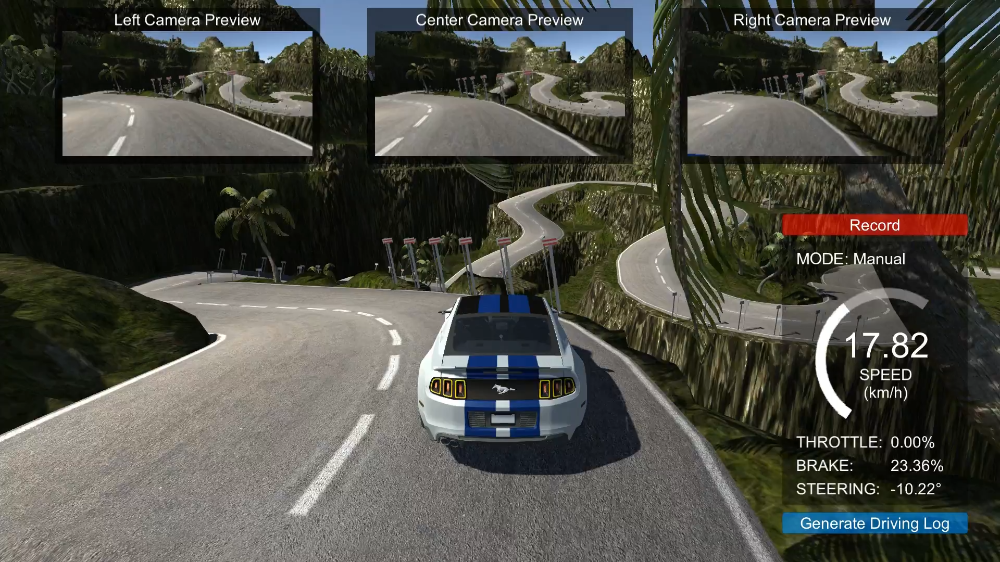

# Behavioral Cloning Simulator
### A Simulation System for Experimenting and Testing Autonomous Driving using Behavioral Cloning

| Lake Track | Mountain Track |
| :------------------:| :------------------: |
|  |  |

## SETUP

1. Download and install Unity 5.5.1f1

2. Clone this repository:

 ```bash
    $ git clone https://github.com/Tinker-Twins/Behavioral-Cloning-Simulator.git
```
3. Launch Unity and click the `OPEN` project button.
  
4. Navigate to and select the parent folder of this repository `Behavioral-Cloning-Simulator`.

## USAGE

### Recording Dataset:
1. Select the track (`Lake Track` or `Mountain Track`).
2. Select `Training Mode`.
3. Click the `Record` button first time to select the directory to store the recorded dataset.
4. Click the `Record` button second time to start recording the dataset.
5. Drive the vehicle manually (click `Controls` button in `Main Menu` to get acquainted with the manual controls).
6. Click the `Recording` button to stop recording the dataset. The button will show recording progress.
  
### Training:
1. Define a training pipeline to clone the human driving behavior based on the recorded dataset.
2. Train a deep neural network model in an end-to-end manner to predict lateral and/or longitudanal control commands based on live camera feed.
3. Save the trained model (e.g. `H5` file).

### Deployment:
1. Define a script to communicate with the Behavioral Cloning Simulator. Following are the WebSocket parameters:
  - IP Address: `127.0.0.1` (i.e. Loopback IP)
  - Port Number: `4567`
2. Define a deployment pipline to generate control commands for the auronomous vehicle using the trained model and/or appropriate control algorithm.
3. Launch the Behavioral Cloning Simulator and run the deployment script.

### Data Logging:
Use the `Generate Driving Log` button in `Training Mode` and/or `Deployment Mode` to log the following data within Unity Editor:
  - Vehicle Position X-Coordinate
  - Vehicle Position Z-Coordinate
  - Throttle Command
  - Brake Command
  - Steering Command
  - Vehicle Speed

## DEMO
This simulator was exploited in the benchmarking research on [Robust Behavioral Cloning for Autonomous Vehicles](https://github.com/Tinker-Twins/Robust_Behavioral_Cloning).

Video demonstrations of this work are available on [YouTube](https://youtube.com/playlist?list=PLY45pkzWzH9_OskmgHXuzW8HmOhWWIqcu).

## CITATION
Please cite the [following paper](https://arxiv.org/abs/2010.04767) when using the Behavioral Cloning Simulator for your research:
```bibtex
@article{RBCAV-2021,
author = {Samak, Tanmay Vilas and Samak, Chinmay Vilas and Kandhasamy, Sivanathan},
title = {Robust Behavioral Cloning for Autonomous Vehicles Using End-to-End Imitation Learning},
journal = {SAE International Journal of Connected and Automated Vehicles},
volume = {4},
number = {3},
pages = {279-295},
month = {aug},
year = {2021},
doi = {10.4271/12-04-03-0023},
url = {https://doi.org/10.4271/12-04-03-0023},
issn = {2574-0741}
}
```
This work has been published in SAE International Journal of Connected and Automated Vehicles, as a part of their Special Issue on Machine Learning and Deep Learning Techniques for Connected and Autonomous Vehicle Applications. The publication can be found on [SAE Mobilus](https://saemobilus.sae.org/content/12-04-03-0023).

## ACKNOWLEDGEMENT
This simulator is a rework of [Udacity's Self-Driving Car Simulator](https://github.com/udacity/self-driving-car-sim).
